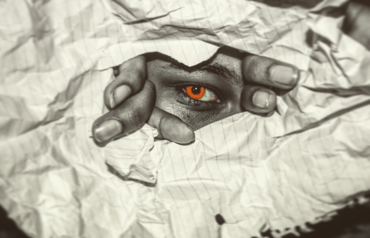

# Art Projects (2019-2023)
A compiled locker filled with my Adobe art projects.

## Photos

This image is due to a project where we had to create our own emoji and abide by the rules and regulations of how emojis are made. This is the "Caught in 4k" emoji that got its origin from TikTok memes and comments.

This is a collage of four different photos depicting an Astronaut floating in the air with heating powers.

First Touch is also a collage of three photos illustrating the purpose and the excitement of feeling another one's hand onto yours.

Dragon eye is one of the first photoshop photos that I used in photoshop to discover how to use and warp shadows and colors to my liking.

## Videos

This is a project that I created that is just a basic blue HUD animation.

https://user-images.githubusercontent.com/54610628/222986024-467a979e-6a78-47ad-866a-4335d3120045.mp4

FireFlies is a project dedicated to combining a project with photoshop and After Effects. The main photo is a collage with three different photos with a firefly video overlaying the combined and edited picture.

https://user-images.githubusercontent.com/54610628/222986512-02dcfff7-c936-4c52-b2da-9ddd1f136f7d.mp4

